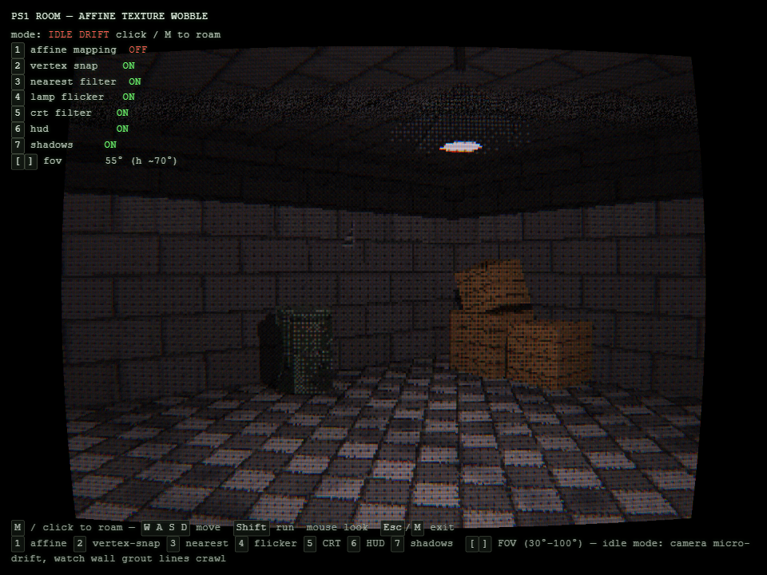
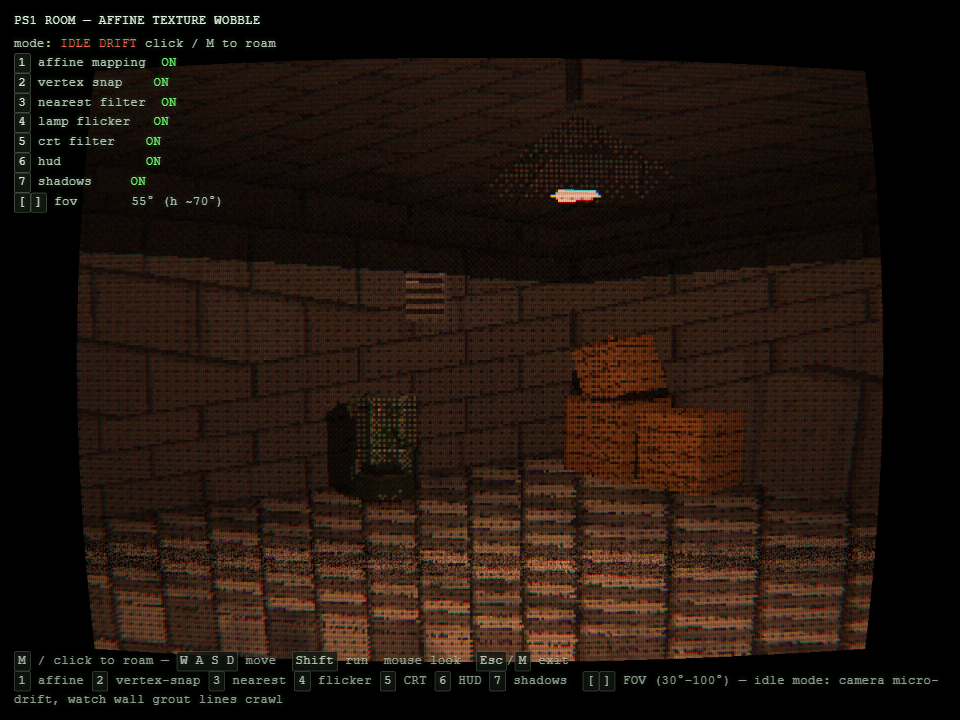
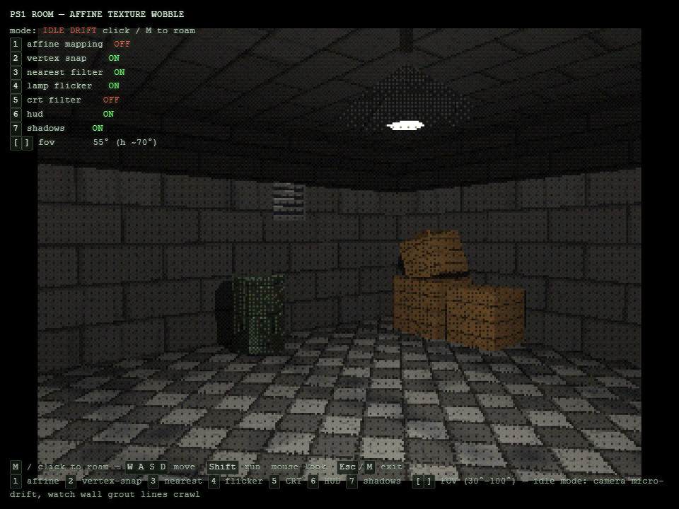
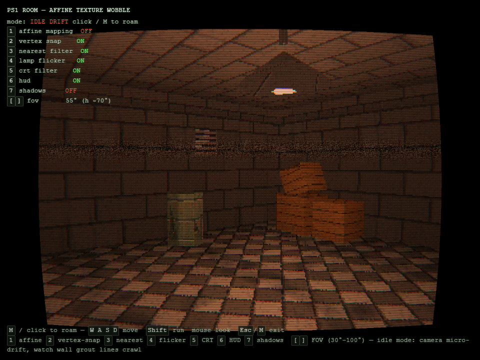
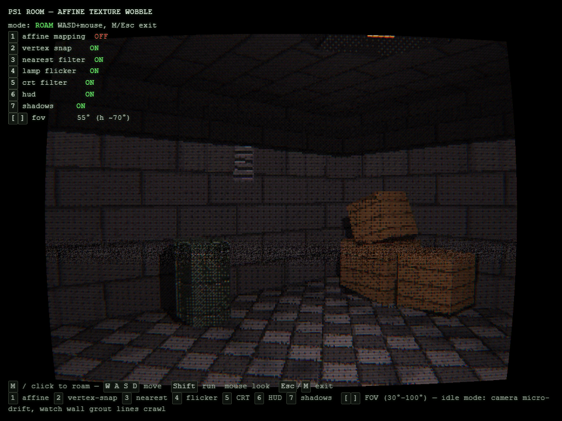
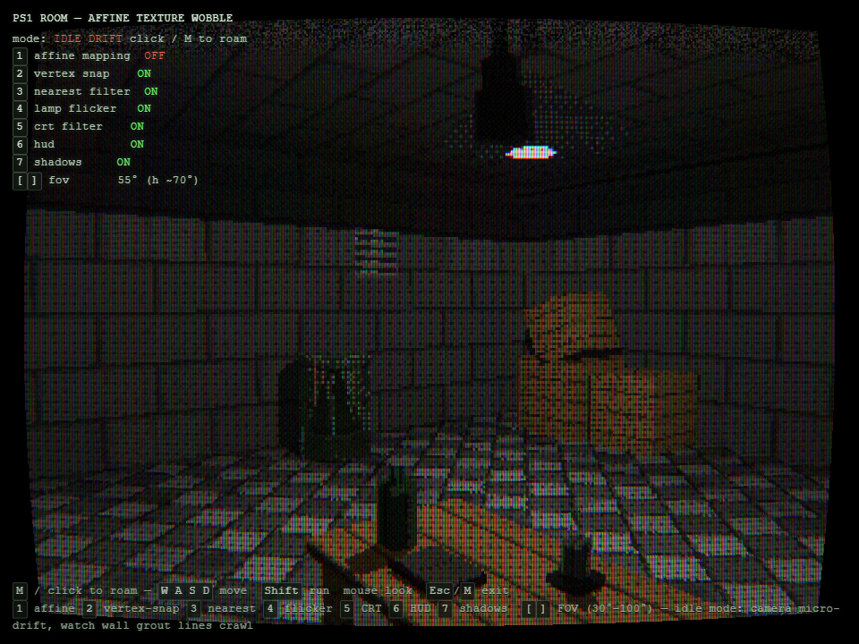
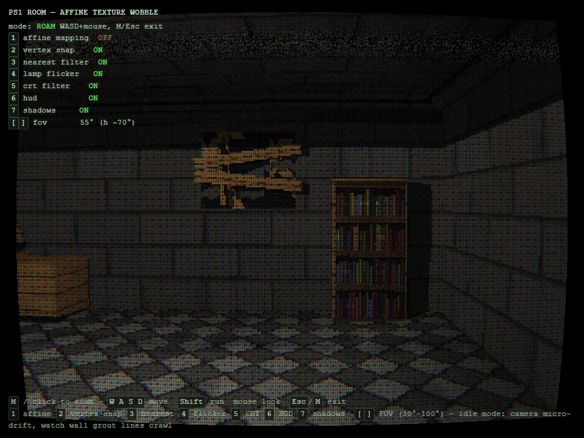

# PS1 Room — 仿射纹理蠕动还原

> 一个**单 HTML 文件、零网络请求**的 PlayStation 1 渲染管线还原演示：在浏览器里用 Three.js + 手写 GLSL 完整复刻 PS1 时代的仿射纹理映射（Affine Texture Mapping）、顶点吸附抖动（Vertex Wobble）、RGB555 色深 + Bayer 抖动、低分辨率渲染与全套 CRT 滤镜，并附带实时点光源阴影、摆动灯泡投影、场景静物装饰与第一人称漫游。



双击打开 [`index.html`](index.html) 即可运行——不需要服务器、不需要 `npm install`、不发起任何网络请求（Three.js r159 已整体内联，所有贴图均为运行时程序化生成）。

---

## 目录

- [效果预览](#效果预览)
- [特性一览](#特性一览)
- [快速开始](#快速开始)
- [操作说明](#操作说明)
- [技术解析](#技术解析)
  - [渲染管线总览](#渲染管线总览)
  - [仿射纹理映射](#仿射纹理映射)
  - [顶点吸附（Vertex Snapping）](#顶点吸附vertex-snapping)
  - [RGB555 + Bayer 抖动](#rgb555--bayer-抖动)
  - [顶点色光照烘焙与灯丝闪烁](#顶点色光照烘焙与灯丝闪烁)
  - [实时点光源阴影](#实时点光源阴影)
  - [CRT 滤镜](#crt-滤镜)
  - [相机系统：微漂移与漫游](#相机系统微漂移与漫游)
  - [程序化贴图](#程序化贴图)
- [项目结构与构建](#项目结构与构建)
- [设计取舍与已知说明](#设计取舍与已知说明)
- [浏览器要求](#浏览器要求)

---

## 效果预览

### 仿射纹理映射（按 <kbd>1</kbd> 开启）

PS1 GPU 没有透视校正（Perspective Correct）纹理单元，UV 随屏幕空间线性插值，相机移动时贴图会像湿贴纸一样"蠕动"。下图中墙面/地面砖缝已发生典型的仿射弯曲：



### 实时阴影（按 <kbd>7</kbd> 开关）

吊灯泡作为唯一光源（PointLight 立方体阴影贴图），木箱在墙面上投影、油桶背光面变暗、道具脚下有 Bayer 抖动的接触阴影：



关闭阴影后同一视角（整体亮度回升、墙面投影消失）：



### 第一人称漫游

点击画面或按 <kbd>M</kbd> 进入漫游模式，<kbd>W A S D</kbd> 走近道具，可贴脸观察阴影与像素结构：



### 场景装饰与动态投影（v5）

前景为桌面静物（绿玻璃瓶 / 烛台 / 摊开的书），天花板中央吊着点亮的锥灯，另有一枚**烧坏的灯泡**沿天花板走线悬挂在桌面上方，以 ±3°、约 4 秒周期缓慢摆动——它是全场景唯一的动态投影体，阴影随摆动扫过桌面与地板：



北墙封板假窗右侧是新加的书架（独立程序化书脊贴图）。注意书架右侧墙面上那块清晰的矩形暗影——就是书架在点光源阴影贴图下的实时投影：



---

## 特性一览

| 类别 | 内容 |
|---|---|
| **真实性** | 320×240 内部分辨率、整数倍最近邻放大、4:3 letterbox |
| **仿射纹理** | 手写 GLSL 取消透视校正，UV 屏幕空间线性插值 → 经典 texture warp |
| **顶点抖动** | 顶点吸附到 320×240 整像素网格 + 深度量化（3 cm 视深桶），相机移动时模型边缘"爬行" |
| **色深还原** | 15-bit RGB555 量化 + 4×4 Bayer 有序抖动 |
| **光照** | 全部顶点色 Gouraud 烘焙（以吊灯为光源位置），叠加每帧灯丝闪烁 uniform |
| **实时阴影** | PointLight 256² 立方体阴影贴图 ×6 面，硬边 + Bayer 抖动半影带；阴影浓度与灯丝闪烁反耦合（"呼吸"） |
| **接触阴影** | 道具脚下硬轮廓抖动贴片（矩形/八边形），纯黑 35% Bayer 密度 |
| **动态投影** | 烧坏灯泡沿走线悬于桌面上方，±3° / 4 s 周期摆动，阴影实时扫过桌面地板 |
| **污渍贴花** | 水渍×2、拖痕、血泊、墙角霉斑——常驻画面，不随 `7` 消失（脏污 ≠ 阴影） |
| **CRT 滤镜** | 扫描线 + 暗角 + RGB 荫罩 + 桶形畸变 + 色差 + 滚动噪波带，一键全关 |
| **场景** | 8×8×3.2 m 密封房间：木箱堆、油桶、吊锥灯、封板假窗、墙顶管道+弯头、通风格栅、桌子+桌面静物（瓶/烛/书）、书架 |
| **相机** | 待机微漂移展示（让蠕动始终可见）⇄ 第一人称漫游（指针锁定优先，不可用时回退为按住左键拖拽转向），3 秒无操作平滑交还 |
| **工程** | 单文件 ~700 KB、零依赖、零网络请求、全部资源运行时程序化生成 |

---

## 快速开始

1. 下载或克隆本仓库；
2. 双击打开根目录的 [`index.html`](index.html)。

完毕。任何现代桌面浏览器均可直接运行，无需联网。

<details>
<summary>从源码构建（可选）</summary>

```bash
node build.js   # 将 src/ + vendor/ 组装为单文件 index.html
```

唯一前置是 Node.js（仅构建时需要），无任何 npm 依赖。
</details>

---

## 操作说明

### 相机 / 移动

| 按键 | 功能 |
|---|---|
| 点击画面 / <kbd>M</kbd> | 进入 / 退出漫游模式（优先指针锁定，锁定不可用时自动回退为拖拽视角） |
| <kbd>W</kbd> <kbd>A</kbd> <kbd>S</kbd> <kbd>D</kbd> | 行走（2.2 m/s） |
| <kbd>Shift</kbd> | 奔跑（4.0 m/s） |
| 鼠标 | 视角：锁定时自由转动；未锁定时**按住左键拖拽**转向（灵敏度 0.0022 rad/px，俯仰 ±85°） |
| <kbd>Esc</kbd> | 退出漫游，3 秒后平滑交还待机漂移 |
| <kbd>[</kbd> / <kbd>]</kbd> | 垂直 FOV 30°–100°，2° 一档（默认 55.4° ≈ 水平 70°） |

### 效果对比开关（可教学演示）

| 按键 | 开关 | 默认 | 说明 |
|---|---|---|---|
| <kbd>1</kbd> | Affine Mapping | OFF | 仿射 ⇄ 透视校正纹理 |
| <kbd>2</kbd> | Vertex Snap | ON | 顶点吸附抖动 ⇄ 平滑几何 |
| <kbd>3</kbd> | Nearest Filter | ON | 最近邻 ⇄ 双线性采样 |
| <kbd>4</kbd> | Lamp Flicker | ON | 灯丝闪烁 ⇄ 恒定 |
| <kbd>5</kbd> | CRT Filter | ON | 全套 CRT ⇄ 纯像素放大 |
| <kbd>6</kbd> | HUD | ON | 状态面板 + 底部提示 |
| <kbd>7</kbd> | Shadows | ON | 实时阴影 + 接触阴影 |

漫游模式下 <kbd>W A S D</kbd> / <kbd>Shift</kbd> 优先作为移动键，效果开关全部使用数字键，互不冲突。

---

## 技术解析

### 渲染管线总览

```
                 ┌────────────────────────────┐
 房间几何+道具 ──▶│ Pass 1: 320×240 RenderTarget│  自定义 PS1 ShaderMaterial
 (世界坐标烘焙)   │  · 仿射 UV / 顶点吸附       │  · 顶点色 Gouraud
                 │  · RGB555 + Bayer 抖动      │  · 点阴影采样 ×0.35 压暗
                 └──────────────┬─────────────┘
                                │ Nearest 整数倍放大
                 ┌──────────────▼─────────────┐
 全屏三角 ──────▶│ Pass 2: CRT Shader          │ 扫描线/荫罩/畸变/色差/噪波
                 └──────────────┬─────────────┘
                                │
                     canvas（4:3 letterbox 居中）
```

另有独立的 **阴影 Pass**：Three.js `WebGLShadowMap` 每帧把 6 个立方体面打进一张 2×3 图集（256²/面），供 Pass 1 的片元着色器采样。

### 仿射纹理映射

现代 GPU 对三角形顶点属性做透视校正插值，PS1 没有。做法是在顶点着色器把 UV 先乘上 `w`，插值后再除一次 `w`——由于插值发生在裁剪空间之后，除法得到的就是**未经透视校正**的屏幕空间线性 UV：

```glsl
// vertex
vAff = vec3(uv * clip.w, clip.w);
// fragment
vec2 u = vAff.xy / vAff.z;   // 透视分量被"错误"地约掉 → 贴图蠕动
```

`1` 键即在 `vAff.xy / vAff.z` 与原始 `vUvP` 之间切换，是同屏对比两种插值的活教材。

### 顶点吸附（Vertex Snapping）

PS1 几何变换输出定点数，顶点位置量化到帧缓冲整像素，相机平移时顶点在像素网格里跳变，产生著名的 polygon judder。在 320×240 空间内实现：

```glsl
vec2 hs = uRes * 0.5;
vec2 px = clip.xy / clip.w * hs + hs;
px = floor(px) + 0.5;                       // 吸附到整像素中心
clip.xy = (px / hs - 1.0) * clip.w;
float wq = floor(clip.w * 32.0) / 32.0;     // 深度量化：视深按 3 cm 分桶 → z-fighting 闪烁
clip.z = -projectionMatrix[2][2] * wq + projectionMatrix[3][2];
```

深度量化刻意选在**视空间线性**分桶，而不是对 `z/w` 全局取 256 级——透视深度高度非线性，全局 256 桶在 6 m 处一档就覆盖 1 m 以上世界深度，书架会整块被后墙"穿模"顶掉贴图；3 cm 线性桶既保留掠射角下的经典 PS1 闪烁，又保证近邻表面（墙-道具间距 ≥ 10 cm）稳定分层。

### RGB555 + Bayer 抖动

PS1 帧缓冲为 15-bit 色深。先用 4×4 Bayer 矩阵（屏幕空间 `floor(mod(gl_FragCoord.xy, 4.0))` 取索引）加半级噪声，再截断到 31 级：

```glsl
c = clamp(c + (b - 0.5) * (1.5 / 32.0), 0.0, 1.0);
c = floor(c * 31.0 + 0.5) / 31.0;
```

同一张 Bayer 贴图还被复用于阴影半影与接触阴影的抖动，保证全画面"网点语言"一致。

### 顶点色光照烘焙与灯丝闪烁

房间不含任何实时光照方程：所有几何在构建时以吊灯位置 `(0, 2.42, 0)` 为光源逐顶点烘焙亮度（距离衰减 × Lambert 朝向项），写入顶点色，由光栅化 Gouraud 插值。每帧再乘一个共享 uniform `uFlicker`（双正弦叠加 + 随机 62% 电压跌落），模拟钨丝灯呼吸。

### 实时点光源阴影

Three.js 的 `ShaderMaterial` 默认不参与阴影系统，本项目通过标准管线打通：

- 材质设 `lights: true`，uniform 合并 `THREE.UniformsLib.lights`，着色器注入 `<shadowmap_pars_vertex>` / `<shadowmap_vertex>` / `<shadowmap_pars_fragment>` 等官方 chunk（顶点着色器提供 `worldPosition = modelMatrix * vec4(position, 1.0)` 与 `transformedNormal`，因此摆动组等带物体矩阵的道具阴影也能正确跟随）；
- 吊灯处挂一个 `PointLight`（强度无意义——自定义片元着色器从不求值光照方程，它唯一的作用是驱动 `WebGLShadowMap` 渲染 256² 立方体阴影图集，near 0.15 / far 7，BasicShadowMap 硬边）；
- 片元端手写 `psPointShadow()` 复刻 r159 点阴影数学：方向向量 → `cubeToUV()` 映射进 2×3 图集 → 与存储深度比较；
- **Bayer 半影**：深度差在 ±6 cm 窗口内与屏幕空间 Bayer 阈值比较，把硬边切出一条有序抖动的过渡带，而非现代软阴影；
- **反耦合呼吸**：阴影只作乘性压暗（×0.35），且压暗深度与 `uFlicker` 反向联动——灯丝跌落瞬间阴影同步变浅；
- **动态摆锤**：烧坏灯泡 + 灯座 + 下垂电线构成一个以天花板悬挂点为原点的 pivot `Group`，每帧做 ±3° 正弦摆动。因为摆动是物体矩阵变换，Three 的阴影 Pass 自动跟随——它是全场景唯一的动态投影体，投影持续扫过桌面与地板；
- **接触阴影**：道具脚下贴地 12 mm 的硬轮廓抖动片（木箱/桌子/书架=矩形、油桶=八边形，比底面大 8%），走同一顶点吸附管线，静态不随闪烁变化。

投影体：木箱×3、油桶、管道+弯头、灯杆+灯罩、窗板、桌子+桌面静物、书架、走线+摆动灯泡；中央灯泡（自发光）与贴墙的格栅/玻璃不投影，烧坏的小灯泡因哑光黑且不发光，是纯粹的投影体。

**污渍贴花与阴影分离**：水渍/拖痕/血泊/霉斑复用同一条"Bayer 阈值 discard"贴片管线（`decalMaterial` 工厂，纯黑接触阴影与彩色污渍只是不同 uniform），但分装在不同的 Group——`7` 键只关掉阴影贴图与接触阴影，脏污贴花常驻画面（脏污不是阴影）。

### CRT 滤镜

第二遍全屏三角采样 320×240 结果，逐像素执行：桶形畸变 → 每通道径向色差 → 隔行扫描线 → RGB 三列荫罩掩膜 → 移动噪波带 + 全画面颗粒 → 暗角 → 低频亮度呼吸。`5` 键关闭后即为"纯像素"参考图。

### 相机系统：微漂移与漫游

**为什么需要待机漂移**：若相机与场景完全静止，仿射蠕动每帧渲染结果相同、效果不可见。待机模式让相机以 ±2 cm / ~1.5° / 20 s 周期微动，蠕动与顶点抖动持续可见。

漫游模式以 Pointer Lock 优先、但不硬依赖它：点击或 <kbd>M</kbd> 切换行走状态并尝试锁定指针。在锁定被拒绝的环境下自动回退为**按住左键拖拽转向**——因为未锁定时操作系统的光标回中 / 窗口重入会产生巨大的 `movementX` 尖峰，鼠标只是划过屏幕就会把视角瞬间"传送"到另一个方向（v5.2 修复的视角跳动问题即源于此）。回退路径同时保留 ±260 px/帧的尖峰钳制作为双保险；拖拽松手产生的 click 会被识别为"拖拽结束"而非"点击退出"，<kbd>Esc</kbd> 释放锁定后再单击则重新抓取锁定。其余移动特性：墙体钳制、道具 AABB 碰撞（人体半径 0.35 m）、步伐起伏；停止输入 3 秒后以四元数 slerp + 位置 lerp 平滑交还待机漂移。

### 程序化贴图

8 张 64×64 贴图全部在运行时用 JS 像素循环生成（45° 斜格地砖、水泥板墙+污渍流痕、木板+钉头、油桶箍环+铆钉+锈斑、管道焊缝+螺栓、格栅叶片、封板夜窗、书架彩色书脊+层板），另加 1 张 4×4 Bayer 矩阵与 1 张 1×1 纯白（灯泡）。因此"零网络"约束下不存在任何外部素材文件，贴图风格参考自 PS1 时代实机截图。

---

## 项目结构与构建

```
ps1-room/
├── index.html            # 最终产物：单文件、零依赖（≈700 KB）
├── build.js              # 组装脚本（模板 + Three.js + app.js 内联）
├── src/
│   ├── index.template.html  # HTML/CSS/HUD 模板（含 /*__THREE__*/ /*__APP__*/ 占位符）
│   └── app.js               # 全部逻辑：着色器/贴图/几何/阴影/相机/输入
├── vendor/
│   └── three.min.js         # Three.js r159 UMD 构建（r160+ 已移除 UMD，故锁定 r159）
└── docs/images/             # 本文档配图
```

```bash
node build.js
# index.html written: 700.5 KB
```

构建脚本会检查内联源码不含 `</script`，防止提前截断脚本标签。

---

## 设计取舍与已知说明

- **阴影是"乘性因子"而非光照**：保持顶点烘焙为亮度基底，阴影只负责压暗——逐像素动态光会破坏 PS1 观感，属于刻意取舍。
- **吊锥灯罩不产生地面光池**：灯罩下缘与灯泡同高，向下光线从裙摆下方离开，锥面遮不住地板（真实物理如此）；阴影收益体现在道具↔墙面/地面的互投影。
- **默认 affine OFF**：启动画面以清晰几何 + 阴影为主展示，蠕动通过 `1` 键一键对比；顶点抖动（默认 ON）保证启动即有"活"的质感。
- **`file://` 直开**：本文件不加载任何外部资源，双击即可运行；个别浏览器对本地页限制 WebGL 时，用任意静态服务器打开即可。
- **性能**：阴影立方体图集每帧重渲染 6 个面，实测 960×720 窗口、阴影全开稳定 160+ FPS；着色器较多，首次打开有短暂编译时间。

## 浏览器要求

- 支持 **WebGL**（Three.js r159）的现代桌面浏览器：Chrome / Edge / Firefox 均可；
- 键盘交互（数字键 1–7、`[` `]`、`M`、`WASD`）；
- 无移动端适配（漫游依赖键盘与鼠标 `movementX/Y`）。

---

## License

MIT — 代码与程序化生成内容均为本项目原创，PS1 相关商标归其持有者。本项目仅为渲染技术还原与教学演示。
