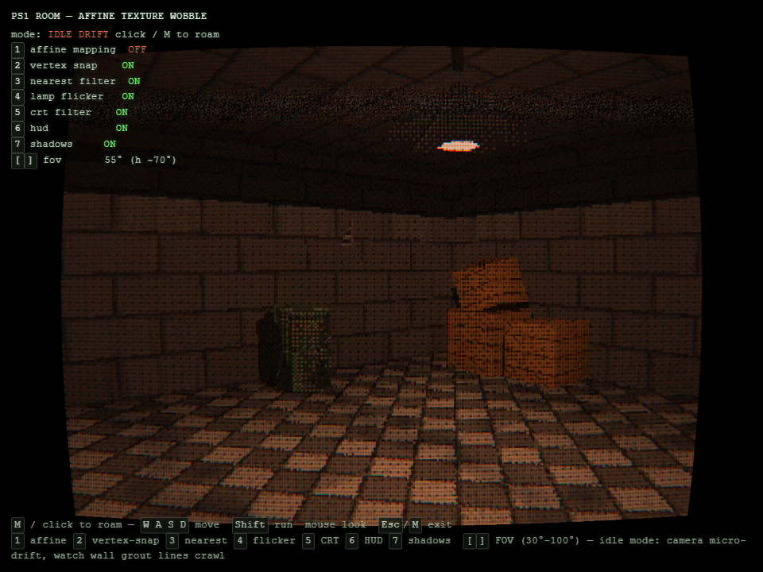

# PS1 Scenes — 仿射纹理蠕动还原 · 九场景

> 一个**单 HTML 文件、零网络请求**的 PlayStation 1 渲染管线还原演示：在浏览器里用 Three.js + 手写 GLSL 完整复刻 PS1 时代的仿射纹理映射（Affine Texture Mapping）、顶点吸附抖动（Vertex Wobble）、RGB555 色深 + Bayer 抖动、低分辨率渲染与全套 CRT 滤镜，并附带实时点光源/方向光阴影、距离雾、天空穹顶、粒子系统与第一人称漫游。现已内置 **9 个可切换场景**：密封房间、黄昏神社、浓雾夜小镇、中世纪集市、赛博雨巷，以及雪岭驿站、大漠驿站、江南水乡夜、太空舷窗四个新成员。


双击打开 [`index.html`](index.html) 即可运行——不需要服务器、不需要 `npm install`、不发起任何网络请求（Three.js r159 已整体内联，所有贴图均为运行时程序化生成）。按 <kbd>N</kbd> 在九个场景间循环切换，URL 加 `#scene=0..8` 可直达指定场景。

---

## 目录

- [效果预览](#效果预览)
- [特性一览](#特性一览)
- [快速开始](#快速开始)
- [操作说明](#操作说明)
- [五个场景](#五个场景)
- [技术解析](#技术解析)
  - [渲染管线总览](#渲染管线总览)
  - [仿射纹理映射](#仿射纹理映射)
  - [顶点吸附（Vertex Snapping）](#顶点吸附vertex-snapping)
  - [RGB555 + Bayer 抖动](#rgb555--bayer-抖动)
  - [场景光照：顶点烘焙 + 彩色多光源](#场景光照顶点烘焙--彩色多光源)
  - [实时阴影：点光源与方向光双管线](#实时阴影点光源与方向光双管线)
  - [距离雾与天空穹顶](#距离雾与天空穹顶)
  - [粒子系统](#粒子系统)
  - [CRT 滤镜](#crt-滤镜)
  - [相机系统：微漂移与漫游](#相机系统微漂移与漫游)
  - [程序化贴图](#程序化贴图)
- [项目结构与构建](#项目结构与构建)
- [设计取舍与已知说明](#设计取舍与已知说明)
- [浏览器要求](#浏览器要求)

---

## 效果预览

### 黄昏神社庭院（<kbd>N</kbd> 切换 · 场景 2）

夕阳平行光长影、三连鸟居、石灯笼暖光窗、锦鲤池睡莲、红枫低多边形树冠、飘落花瓣粒子、远山剪影融入暖雾：


### 浓雾夜小镇（场景 3）

寂静岭式距离雾是 PS1 的标志性记忆：路灯暖光池烘进顶点色、亮灯的窗、下垂电缆、水塔剪影没入雾中：


### 中世纪黄昏集市（场景 4）

半木结构房屋（外挑二层 + 陡屋顶 + 烟囱冒烟）、条纹遮阳篷摊位、中央喷泉流水、条幅与彩旗、啄食的鸽子、金色浮尘：


### 赛博朋克雨巷（场景 5）

像素汉字霓虹（酒 / 電 / 麺 / 24H，其中麺馆招牌镇流器接触不良）、雨粒子、湿地面上的彩色霓虹光池、蒸汽口、头顶电缆阵：


### 雪岭驿站（场景 6）

蓝调时分的雪原垭口：原木驿站的多层暖黄发光窗、雪压屋顶与檐下冰帘、烟囱炊烟、雪杉与雪人、雪橇与犬舍、脚印链通向水井，340 片雪花持续飘落，远景雪山剪影融入冷雾：


### 大漠驿站（场景 7）

正午近天顶硬光（全场景最短影）：绿洲水潭与棕榈、卧立双峰骆驼、条纹帐篷集市、香料毯与馕堆、商队板车与猎鹰栖木，红色砂岩台地立在地平线上，热雾中漂着金色浮尘：


### 江南水乡夜（场景 8）

站在石拱桥上沿运河眺望：白墙黛瓦与马头墙夹着水面走廊、成串红灯笼映在水上的红色倒影光带、两条乌篷船（一条上有睡猫）、酒旗随风摆、水面浮着薄雾，星空偶有流星：


### 太空舷窗（场景 9）

观测舱内望向舷窗：带环气态巨行星（横条纹 + 风暴斑 + 同心环带）悬在密集星野中，小月亮与横穿的货运卫星作伴；窗棂在甲板上投下硬边格影，光柱里浮尘缓慢漂移，失重漂浮的马克杯缓缓翻滚，巡地机器人在画八字：


### 密封房间（场景 1 · 回归保留）

v5 的原场景原样保留，作为单点光源阴影与灯丝闪烁的对照：



---

## 特性一览

| 类别 | 内容 |
|---|---|
| **真实性** | 320×240 内部分辨率、整数倍最近邻放大、4:3 letterbox |
| **仿射纹理** | 手写 GLSL 取消透视校正，UV 屏幕空间线性插值 → 经典 texture warp |
| **顶点抖动** | 顶点吸附到 320×240 整像素网格 + 深度量化（3 cm 视深桶），相机移动时模型边缘"爬行" |
| **色深还原** | 15-bit RGB555 量化 + 4×4 Bayer 有序抖动 |
| **场景光照** | 全部顶点色 Gouraud 烘焙：单点灯（房间）/ 平行太阳·月光 + 半球环境光（室外）/ **逐通道彩色多光源**（小镇路灯 ×5、雨巷霓虹 ×5） |
| **实时阴影** | 点光源 256² 立方体阴影（房间）+ 方向光 1024² 阴影（室外），硬边 + Bayer 抖动半影带 |
| **距离雾** | 每场景独立雾色/雾距，与天空穹顶地平线颜色严格一致，几何体无缝没入天幕 |
| **天空穹顶** | 程序化渐变天幕 + 太阳/月亮圆面 + 辉光 + 程序星点（闪烁）+ **流星**（夜场景每 ~9 s 一颗划过），过 RGB555 抖动保持网点语言统一 |
| **粒子系统** | 花瓣（摇曳下落）/ 雨（斜落）/ 蒸汽（上升渐隐）/ 浮尘（漂移）四种模式复用同一着色器——金色浮尘、**萤火虫**（黄绿）是浮尘的配色变体，香炉烟/**火盆火焰**（橙红快速上升）是蒸汽的速度配色变体，全部走同一顶点吸附管线 |
| **接触阴影** | 道具脚下硬轮廓抖动贴片（矩形/八边形），纯黑 35% Bayer 密度 |
| **污渍贴花** | 室内水渍/血泊/霉斑，室外苔藓/落叶毯/稻草/泥泞/霓虹光池/海报涂鸦——常驻画面，不随 `7` 消失；贴花按**深度分层**（0.75/1.1/1.6 个量化桶）浮于底面之上，杜绝与宿主表面共桶 z-fighting 闪烁 |
| **CRT 滤镜** | 扫描线 + 暗角 + RGB 荫罩 + 桶形畸变 + 色差 + 滚动噪波带，一键全关 |
| **场景** | ① 密封房间 ② 神社庭院（鸟居×3/锦鲤池/绘马架/手水舎/香炉/萤火虫）③ 雾镇（路灯/轿车/栅栏猫/秋千/流星）④ 集市（喷泉/摊位×4/火盆火焰/睡狗/独轮车/灯笼串）⑤ 雨巷（霓虹+滚动电子屏/灯串/猫眼/雨伞）⑥ 雪岭驿站（原木驿站+暖窗/雪杉/雪人/雪橇/飘雪）⑦ 大漠驿站（绿洲/棕榈/骆驼×2/条纹帐篷/砂岩台地）⑧ 水乡夜（运河/石拱桥/马头墙×8/红灯笼串+倒影/乌篷船）⑨ 太空舷窗（带环气态行星/卫星/舷窗格影/闪灯控制台） |
| **相机** | 待机微漂移 ⇄ 第一人称漫游（指针锁定优先，回退按住左键拖拽），每场景独立取景/出生点/碰撞体 |
| **工程** | 单文件 ~785 KB、零依赖、零网络请求、全部资源运行时程序化生成、`#scene=N` 直达场景 |

---

## 快速开始

1. 下载或克隆本仓库；
2. 双击打开根目录的 [`index.html`](index.html)。

完毕。任何现代桌面浏览器均可直接运行，无需联网。

<details>
<summary>从源码构建（可选）</summary>

```bash
node build.js   # 将 vendor/ + src/app.js + src/scenes/*.js 组装为单文件 index.html
```

唯一前置是 Node.js（仅构建时需要），无任何 npm 依赖。
</details>

---

## 操作说明

### 场景 / 相机 / 移动

| 按键 | 功能 |
|---|---|
| <kbd>N</kbd> | 切换到下一个场景（黑屏淡入淡出，共 5 个循环） |
| <kbd>M</kbd> / 点击画面 | 进入 / 退出漫游模式（优先指针锁定，锁定不可用时自动回退为拖拽视角） |
| <kbd>W</kbd> <kbd>A</kbd> <kbd>S</kbd> <kbd>D</kbd> | 行走（2.2 m/s） |
| <kbd>Shift</kbd> | 奔跑（4.0 m/s） |
| 鼠标 | 视角：锁定时自由转动；未锁定时**按住左键拖拽**转向（灵敏度 0.0022 rad/px，俯仰 ±85°） |
| <kbd>Esc</kbd> | 退出漫游，3 秒后平滑交还待机漂移 |
| <kbd>[</kbd> / <kbd>]</kbd> | 垂直 FOV 30°–100°，2° 一档（默认 55.4° ≈ 水平 70°） |

### 效果对比开关（可教学演示）

| 按键 | 开关 | 默认 | 说明 |
|---|---|---|---|
| <kbd>1</kbd> | Affine Mapping | OFF | 仿射 ⇄ 透视校正纹理 |
| <kbd>2</kbd> | Vertex Snap | ON | 顶点吸附抖动 ⇄ 平滑几何 |
| <kbd>3</kbd> | Nearest Filter | ON | 最近邻 ⇄ 双线性采样 |
| <kbd>4</kbd> | Lamp Flicker | ON | 灯丝闪烁 ⇄ 恒定（仅房间场景有灯丝；室外场景各有灯笼微闪/霓虹坏镇流器） |
| <kbd>5</kbd> | CRT Filter | ON | 全套 CRT ⇄ 纯像素放大 |
| <kbd>6</kbd> | HUD | ON | 状态面板 + 底部提示 |
| <kbd>7</kbd> | Shadows | ON | 实时阴影 + 接触阴影 |
| <kbd>8</kbd> | Fog | ON | 距离雾（室外场景；房间无雾此键无效） |
| <kbd>9</kbd> | Particles | ON | 粒子系统（花瓣/雨/蒸汽/浮尘，按场景） |

漫游模式下 <kbd>W A S D</kbd> / <kbd>Shift</kbd> 优先作为移动键，效果开关全部使用数字键，互不冲突。

---

## 五个场景

| # | 场景 | 光源 | 雾 | 粒子 | 漫游范围 |
|---|---|---|---|---|---|
| 1 | 密封房间 | 吊灯点光源（阴影 + 灯丝闪烁） | 无 | 无 | 8×8 m 密封 |
| 2 | 黄昏神社庭院 | 夕阳平行光（长影） | 暖雾 26–64 m | 花瓣 ×210 + 香烟 ×36 + 萤火虫 ×90 | 25×20 m 庭院 |
| 3 | 浓雾夜小镇 | 月光平行光 + 路灯暖光池（烘焙） | 浓雾 5–29 m | 无 | 10×37 m 街道 |
| 4 | 中世纪黄昏集市 | 金色夕阳平行光 | 暖雾 28–66 m | 浮尘 ×150 + 炊烟 ×60 + 火盆火焰 ×84 | 23×24 m 广场 |
| 5 | 赛博朋克雨巷 | 暗月光 + 霓虹彩色光池（逐通道烘焙） | 紫雾 7–38 m | 雨 ×520 + 蒸汽 ×160 | 6.7×34 m 巷道 |
| 6 | 雪岭驿站 | 弱月光 + 强半球雪反光 | 冷雾 20–55 m | 飘雪 ×340 + 炊烟 ×60 | 27×24 m 雪原 |
| 7 | 大漠驿站 | 近天顶硬光（短影）+ 沙地暖反光 | 热雾 30–70 m | 金色浮尘 ×120 | 29×24 m 营地 |
| 8 | 江南水乡夜 | 月光 + 红灯笼烘焙光池 ×16 | 夜雾 7–33 m | 水面薄雾 ×70 | 37×18 m 运河 |
| 9 | 太空舷窗 | 舷外恒星光（窗棂格影）+ 舱内顶光 | 无雾（真空） | 光柱浮尘 ×110 | 8×10 m 观测舱 |

每个场景独立拥有：程序化贴图集、顶点烘焙光照函数、阴影光源配置、天空穹顶参数、雾参数、待机运镜取景、出生点、AABB 碰撞体集合和逐帧更新回调（游鱼/条幅/鸽子/坏霓虹等动画）。

---

## 技术解析

### 渲染管线总览

```
                 ┌────────────────────────────┐
 场景几何+道具 ──▶│ Pass 1: 320×240 RenderTarget│  自定义 PS1 ShaderMaterial
 (世界坐标烘焙)   │  · 仿射 UV / 顶点吸附       │  · 顶点色 Gouraud
 + 天空穹顶      │  · RGB555 + Bayer 抖动      │  · 阴影采样 ×0.35 压暗
 + 粒子          │  · 逐场景距离雾              │  · 彩色多光源已烘进顶点色
                 └────────────┬─────────────┘
                                │ Nearest 整数倍放大
                 ┌────────────▼─────────────┐
 全屏三角 ──────▶│ Pass 2: CRT Shader          │ 扫描线/荫罩/畸变/色差/噪波
                 └────────────┬─────────────┘
                                │
                     canvas（4:3 letterbox 居中）
```

另有独立的**阴影 Pass**：房间场景 `WebGLShadowMap` 渲染点光源 6 面立方体图集（256²/面）；室外场景渲染方向光正交阴影（1024²），供 Pass 1 的片元着色器采样。

### 仿射纹理映射

现代 GPU 对三角形顶点属性做透视校正插值，PS1 没有。做法是在顶点着色器把 UV 先乘上 `w`，插值后再除一次 `w`——由于插值发生在裁剪空间之后，除法得到的就是**未经透视校正**的屏幕空间线性 UV：

```glsl
// vertex
vAff = vec3(uv * clip.w, clip.w);
// fragment
vec2 u = vAff.xy / vAff.z;   // 透视分量被"错误"地约掉 → 贴图蠕动
```

`1` 键即在 `vAff.xy / vAff.z` 与原始 `vUvP` 之间切换，是同屏对比两种插值的活教材。

### 顶点吸附（Vertex Snapping）

PS1 几何变换输出定点数，顶点位置量化到帧缓冲整像素，相机平移时顶点在像素网格里跳变，产生著名的 polygon judder。在 320×240 空间内实现：

```glsl
vec2 hs = uRes * 0.5;
vec2 px = clip.xy / clip.w * hs + hs;
px = floor(px) + 0.5;                       // 吸附到整像素中心
clip.xy = (px / hs - 1.0) * clip.w;
float wq = floor(clip.w * 32.0) / 32.0;     // 深度量化：视深按 3 cm 分桶 → z-fighting 闪烁
clip.z = -projectionMatrix[2][2] * wq + projectionMatrix[3][2];
```

深度量化刻意选在**视空间线性**分桶：透视深度高度非线性，全局 256 桶在 6 m 处一档就覆盖 1 m 以上世界深度，近邻表面会整块互相"穿模"顶掉贴图；3 cm 线性桶既保留掠射角下的经典 PS1 闪烁，又保证近邻表面稳定分层。粒子系统与贴花共用同一段吸附代码。

### RGB555 + Bayer 抖动

PS1 帧缓冲为 15-bit 色深。先用 4×4 Bayer 矩阵（屏幕空间 `floor(mod(gl_FragCoord.xy, 4.0))` 取索引）加半级噪声，再截断到 31 级：

```glsl
c = clamp(c + (b - 0.5) * (1.5 / 32.0), 0.0, 1.0);
c = floor(c * 31.0 + 0.5) / 31.0;
```

同一张 Bayer 贴图被复用于阴影半影、接触阴影、贴花镂空、粒子渐隐与**天空穹顶**，保证全画面"网点语言"一致。

### 场景光照：顶点烘焙 + 彩色多光源

所有场景不含任何实时光照方程：几何构建时以该场景的光照函数逐顶点烘焙亮度写入顶点色，由光栅化 Gouraud 插值。这是 PS1 的标准做法，也因此天然支持**彩色多光源**——烘焙函数返回 RGB 三通道：

- **房间**：吊灯单点光源（距离衰减 × Lambert），每帧乘共享 `uFlicker`（双正弦 + 随机电压跌落）模拟钨丝呼吸；
- **室外**：平行光（夕阳/月光，N·L 朝向项，无距离衰减）+ 半球环境光（法线朝上混天光、朝下混地光）；
- **小镇**：在月光之上叠加 5 盏路灯的暖色点光池（`k/(1+d²·c)` 衰减）；
- **雨巷**：5 处霓虹**逐通道**彩色光池（红/品红/青/黄各有独立 RGB 贡献），湿地面上的彩色"倒影"光池是同色贴花。

地面用细分网格（如 11×11）烘焙，光池以逐顶点 Gouraud 块状渐变呈现——低密度顶点光正是 PS1 夜景的经典质感。发光体（灯泡/灯笼窗/霓虹面/贩卖机面板）不走烘焙，直接写 >1 的顶点色。

### 实时阴影：点光源与方向光双管线

Three.js 的 `ShaderMaterial` 默认不参与阴影系统，本项目通过标准管线打通（材质 `lights: true` + 注入官方 shadowmap chunk，片元端手写采样数学）。两套阴影共存于同一着色器，由 `NUM_POINT_LIGHT_SHADOWS` / `NUM_DIR_LIGHT_SHADOWS` 编译期开关——每个场景恰有一盏投影主光，程序按场景光源配置自动编译对应分支：

- **点光源**（房间）：256² 立方体图集 ×6 面，方向向量 → `cubeToUV()` → 深度比较；
- **方向光**（室外）：1024² 正交阴影贴图覆盖全场，投影正交盒 ±14~22 m；
- 两者共用 **Bayer 半影**：深度差窗口内与屏幕空间 Bayer 阈值比较，硬边切出有序抖动的过渡带；阴影只作乘性压暗（×0.35）保持顶点烘焙为亮度基底；
- 摆动/游动/旋转的道具（摆灯、锦鲤、车轮）阴影自动跟随——物体矩阵变换由阴影 Pass 天然支持；
- `7` 键同时关掉阴影贴图与接触阴影贴片；污渍/苔藓/光池贴花常驻（脏污不是阴影）。
- **贴花深度分层（防闪烁）**：视深量化按 3.125 cm 分桶后，浮高小于一桶的贴花会与底面落进同一桶、深度完全相等——相机微漂移时两者胜负逐帧翻转，这就是"贴花在底面上闪烁"的根源。修复分两手：① 贴花顶点着色器在量化后把深度**前移 0.75 个桶**（以桶为单位偏移，任何视距都正确），并按类别分层（污渍 0.75 / 光池 1.1 / 接触阴影 1.6），贴花互相叠放也永不共桶；② 所有"贴面薄片"（霓虹面/贩卖机面板/灯笼发光窗/窗户贴片/书架书脊面）的物理间距抬到 ≥ 4 cm（大于一桶）。已用两个不同相机时刻的截图对比贴花区域色统计（差异 < 1/255）验证稳定。

### 距离雾与天空穹顶

PS1 主机显存有限，距离雾是那个时代隐藏裁剪距离的标准手法（寂静岭把它用成了美学）。片元端按视空间距离做 `smoothstep(fogNear, fogFar, vDist)` 混合，且**雾在 RGB555 量化之前**执行——雾本身也带网点抖动。天空穹顶是一个 90 m 反向球面，片元程序化生成：地平线→天顶渐变、太阳/月亮圆面 + 辉光、hash 星点（夜场景，带闪烁），最后过同一套 RGB555 + Bayer 量化。关键约束：**每场景雾色 == 天穹地平线色**，几何体没入雾中时与天幕无缝衔接。穹顶不做顶点吸附（半径 90 m 的吸附抖动会是地震级）。

### 粒子系统

单个 `THREE.Points` 着色器四种模式（`uMode` 分支），位置由种子属性 + 时间在顶点着色器程序化求出（无 CPU 逐帧更新）：花瓣（慢速摇曳下落 + 双正弦摆动）、雨（快速斜落）、蒸汽（上升 + 半径扩散 + 高度渐隐）、浮尘（超慢漂移 + 亮度呼吸）。配色与参数即氛围：金色浮尘（集市）、黄绿浮尘=萤火虫（神社池塘黄昏）、橙色高速蒸汽=火焰（集市火盆）、灰白慢蒸汽=香炉烟/炊烟/巷口蒸汽。粒子走同一顶点吸附管线（会跟着抖动，浑然一体），片元以 Bayer 阈值 discard 实现渐隐/软边，点大小按视距缩放。切换场景时各场景粒子随整场景换装；`9` 键总开关。

### CRT 滤镜

第二遍全屏三角采样 320×240 结果，逐像素执行：桶形畸变 → 每通道径向色差 → 隔行扫描线 → RGB 三列荫罩掩膜 → 移动噪波带 + 全画面颗粒 → 暗角 → 低频亮度呼吸。`5` 键关闭后即为"纯像素"参考图。

### 相机系统：微漂移与漫游

**为什么需要待机漂移**：若相机与场景完全静止，仿射蠕动每帧渲染结果相同、效果不可见。待机模式让相机以 ±2 cm / ~1.5° / 20 s 周期微动，蠕动与顶点抖动持续可见。每场景有独立设计的待机取景（神社沿参道望向神社、小镇望向雾深处、集市望向喷泉、雨巷望向巷子尽头）。

漫游模式以 Pointer Lock 优先、但不硬依赖它：点击或 <kbd>M</kbd> 切换行走状态并尝试锁定指针。在锁定被拒绝的环境下自动回退为**按住左键拖拽转向**（未锁定时 OS 光标回中会产生巨大 `movementX` 尖峰，因此回退路径只认拖拽，并保留 ±260 px/帧尖峰钳制双保险）。其余移动特性：场景边界钳制、道具 AABB 碰撞（人体半径 0.35 m）、步伐起伏；停止输入 3 秒后以四元数 slerp + 位置 lerp 平滑交还待机漂移。<kbd>N</kbd> 切场景时黑屏淡入淡出，相机与碰撞体整套热替换。

### 程序化贴图

30 余张 64×64 贴图全部在运行时用 JS 像素循环生成，按场景分组：房间 8 张（地砖/水泥墙/木板/油桶/管道/格栅/封板窗/书脊）；神社 8 张（耙纹碎石/花岗岩/朱红漆/水面/树皮/红叶团/木板/瓦屋顶）；小镇 8 张（湿沥青+车道线/人行道板/三种木墙板/两种屋瓦/锈金属/夜草）；集市 10 张（卵石/石膏/木梁/红绿条纹篷/石器/水/麻布/木瓦/条旗）；雨巷 8 张（湿沥青/砖墙/混凝土/卷帘门/金属/四张像素汉字霓虹/贩卖机面板）。"零网络"约束下不存在任何外部素材文件，贴图风格参考 PS1 时代实机截图。

---

## 项目结构与构建

```
ps1-room/
├── index.html            # 最终产物：单文件、零依赖（≈785 KB）
├── build.js              # 组装脚本（模板 + Three.js + 核心 + 各场景 + 启动入口）
├── src/
│   ├── index.template.html  # HTML/CSS/HUD 模板（含 /*__THREE__*/ /*__APP__*/ 占位符）
│   ├── app.js               # 核心引擎：着色器/材质/天空/粒子/贴花/几何工厂/场景注册/相机/输入/CRT
│   ├── scenes/
│   │   ├── room.js          # 场景 1：密封房间（单点光源 + 立方体阴影 + 灯丝闪烁）
│   │   ├── shrine.js        # 场景 2：黄昏神社庭院（夕阳方向光 + 花瓣 + 水面动画 + 游鱼）
│   │   ├── town.js          # 场景 3：浓雾夜小镇（月光 + 路灯光池烘焙 + 电缆/水塔）
│   │   ├── market.js        # 场景 4：中世纪黄昏集市（金色阳光 + 喷泉 + 条幅摆动 + 鸽子）
│   │   ├── cyber.js         # 场景 5：赛博朋克雨巷（彩色霓虹烘焙 + 雨 + 蒸汽 + 坏镇流器）
│   │   ├── snow.js          # 场景 6：雪岭驿站（雪反光半球光 + 飘雪 + 雪人/雪橇/木屋）
│   │   ├── desert.js        # 场景 7：大漠驿站（近天顶硬光 + 绿洲/棕榈/骆驼/砂岩台地）
│   │   ├── watertown.js     # 场景 8：江南水乡夜（运河/石拱桥/马头墙/红灯笼倒影）
│   │   └── space.js         # 场景 9：太空舷窗（星野 + 带环气态行星 + 舷窗硬光格影）
│   └── main.js              # 启动入口：全部场景注册完毕后 PS1.boot()
├── vendor/
│   └── three.min.js         # Three.js r159 UMD 构建（r160+ 已移除 UMD，故锁定 r159）
└── docs/images/             # 本文档配图
```

```bash
node build.js
# index.html written: 785.3 KB
```

构建脚本会检查内联源码不含 `</script`，防止提前截断脚本标签。场景模块通过 `PS1.registerScene(builder)` 注册，核心引擎在启动时按注册顺序构建全部场景、`N` 键循环热切换——新增一个场景只需在 `src/scenes/` 加一个文件并在 `build.js` 里列一行。

---

## 设计取舍与已知说明

- **阴影是"乘性因子"而非光照**：保持顶点烘焙为亮度基底，阴影只负责压暗——逐像素动态光会破坏 PS1 观感，属于刻意取舍。
- **每场景恰一盏投影光**：点光立方体与方向光正交两套采样共存于同一着色器，由场景光源配置在编译期选择；多盏投影光的性能预算在 320×240 目标下不予考虑。
- **室外无仿射地面"蠕变"穿帮**：大面积地面/天空在低分辨率下的仿射弯曲是刻意保留的 PS1 味道，`1` 键可对照。
- **天穹不做顶点吸附**：90 m 半径的整像素吸附会产生地震级抖动；天穹以自身渐变 + 网点量化呈现，其余一切几何（含粒子）照常抖动。
- **霓虹"倒影"是贴花不是镜面**：湿地面彩色光池为同色 Bayer 贴花，真实平面反射不在 PS1 语法内。
- **默认 affine OFF**：启动画面以清晰几何 + 阴影为主展示，蠕动通过 `1` 键一键对比；顶点抖动（默认 ON）保证启动即有"活"的质感。
- **`file://` 直开**：本文件不加载任何外部资源，双击即可运行；个别浏览器对本地页限制 WebGL 时，用任意静态服务器打开即可。
- **性能**：阴影贴图每帧重渲染当前场景一盏投影光；实测 1280×960 窗口、五场景阴影/雾/粒子全开均稳定 60+ FPS；着色器较多，首次打开有短暂编译时间。

## 浏览器要求

- 支持 **WebGL**（Three.js r159）的现代桌面浏览器：Chrome / Edge / Firefox 均可；
- 键盘交互（数字键 1–9、`[` `]`、`N`、`M`、`WASD`）；
- 无移动端适配（漫游依赖键盘与鼠标 `movementX/Y`）。

---

## License

MIT — 代码与程序化生成内容均为本项目原创，PS1 相关商标归其持有者。本项目仅为渲染技术还原与教学演示。
